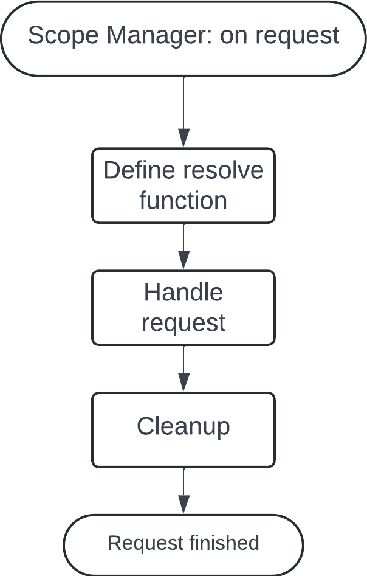

# Dependency injection
This is a simple dependency injection system for TypeScript. This is a generic system that can be used in any TypeScript project. A class can be labeled as a singleton, transient or scoped. The system will automatically create the class and inject the dependencies as needed.

**Table of contents**
- [How to use](#how-to-use)
  - [Injecting dependencies](#injecting-dependencies)
  - [Add support for decorators in tsconfig.json](#add-support-for-decorators-in-tsconfigjson)
- [Testing dependencies](#testing-dependencies)
- [Scope manager](#scope-manager)
  - [Example](#example)
- [API](#api)
  - [Types](#types)
  - [IOCContainer](#ioccontainer)
- [How it works](#how-it-works)
  - [IOC Container](#ioc-container)
    - [Singletons](#singletons)
    - [Transient and Scoped](#transient-and-scoped)
  - [Injecting](#injecting)
  - [Tokens](#tokens)

## How to use
Use TypeScript's decorators to label a class. You can use the following decorators

| Name      | Used for |
| --------- | -------- |
| Singleton | Only one instance of the class will be created |
| Transient | Every time the dependency is used, a new instance will be created |
| Scoped    | A new instance will be created for each scope |

> **Note:** There is support for scoped dependencies, however the scopes are not managed by this system. The developer must implement the scope management. An example of a scope manager for Sveltekit can be found below.

```typescript
import { Singleton } from "./dependency-injection";

@Singleton
class MyService {
  // Implementation of MyService
}
```

After that, just import the file that contains the class and the IOC will automatically load it.

```typescript
import "./services/MyService";
```

### Injecting dependencies
Inside another class, use the `Inject` decorator on a property to automatically inject the dependency.

```typescript
import { Inject } from "./dependency-injection";

class SomeClass {
  @Inject("MyService") private myService: IMyService;
}
```
> **Note:** The string passed to the `Inject` decorator must match the name of the class that was labeled with the decorator.

### Add support for decorators in tsconfig.json
Add the following lines to your `tsconfig.json` file to enable support for decorators.

```json
{
  "compilerOptions": {
    "experimentalDecorators": true,
    "emitDecoratorMetadata": true
  }
}
```

## Testing dependencies
After importing all the classes used in the project, you can let the IOC container test all the dependency references. You can find an example below.

```typescript
import { IOCContainer } from "./dependency-injection";
const result = IOCContainer.testDependencyReferences();

if (!result.valid) {
  console.error("Dependency resolution test failed.");
  for (const error of result.errors) {
    console.error(error);
  }
  process.exit(1);
}
```

## Scope Manager
By default, scopes are handled the same as transient dependencies. After resolving a dependency using `IOCManager#resolve`, you can call `IOCManager#registerScope` with the resolved class instance and a method to resolve dependencies. This method will be used to resolve dependencies for the class instance.

Here is a really simple example of a scope manager. This manager does not store the class instances in the scope. For a full example, take a look at the Scope Manager example for Sveltekit.
```typescript
function resolve<T>(dependency: string): T {
  // Resolve the dependency using the IOC Container
  const resolvedDependency = IOCContainer.resolve<T>(dependency);

  // We need to tell the IOC Container about the scope we just created
  // When the dependency tries to access a sub dependency, it will use the resolve method we just added
  IOCContainer.registerScope(resolvedDependency, resolve);
}
```

In most cases, a Scope Manager should follow the following steps.



### Example
<details>
  <summary>Example Scope Manager for Sveltekit</summary>

  This is an example of a Scope Manager for Sveltekit. This manager will create a new instance of the class for each request.

  **hooks.server.ts**
  ```typescript
    // For every request, the method below is called. A new scope will be created for each request. After the request is handled, the scope is deleted.
    export async function handle({ resolve, event }) {
      // Create a new map to store scoped dependencies
      const scopedDependencies: Map<string, any> = new Map();

      // Add a resolve method to locals to resolve within the current scope
      event.locals.resolve = function<T>(dependency: string) {
        // First, check if the dependency is already resolved in the current scope
        if (scopedDependencies.has(dependency)) {
          return scopedDependencies.get(dependency);
        }

        // Resolve the dependency
        const resolvedDependency = IOCContainer.resolve<T>(dependency);

        // Get the injection type of the dependency
        const isScopedDependency = IOCContainer.getInjectionType(dependency) === "Scoped";

        // The dependency is scoped, we need to store the current dependency and register the scope
        if (isScopedDependency) {
          // For scoped dependencies, we need to store the current dependency and register the scope
          scopedDependencies.set(dependency, resolvedDependency);

          // Lastly, we need to tell the IOC Container about the scope we just created
          // When the dependency tries to access a sub dependency, it will use the resolve method we just added
          IOCContainer.registerScope(resolvedDependency, event.locals.resolve);
        }

        // Now, we can return the resolved dependency
        return resolvedDependency;
      }

      // Resolve the event
      const result = await resolve(event);

      // Clean up the dependency scope
      IOCContainer.cleanScope(scopedDependencies.keys());
      scopedDependencies.clear();

      // Done with the request
      return result;
    }
  ```

  **app.d.ts**
  ```typescript
    // This is only needed to add the resolve method type definition to the event.locals object
    declare namespace App {
      interface Locals {
        resolve<T>(dependency: string): T;
      }
    }
  ```

  This Scope Manager follows the following steps.

  

</details>

## API


### Types
- **`Constructor<T = {}>`** <br>
  Base type for a class constructor that results in a class instance.

- **`DependencyInjectionType`** <br>
  The type of dependency injection. Can be "Singleton", "Transient" or "Scoped".

- **`DependencyResolutionResult`** <br>
  Object with two keys.
  - `valid: boolean` <br>
    True if all dependency references are valid.
  - `errors: string[]` <br>
    Array of possible error messages if the dependency references are not valid.

### IOCContainer
> **Note:** The only methods you would use are `registerScope`, `cleanScope` and `testDependencyReferences`. The other methods should only be used internally.
> _All methods are static_

- **`register<T>(name: string, injectionType: DependencyInjectionType, implementation: Constructor<T>)`** <br>
  Register a class with the IOC container. <br>
  _This method is automatically called when using @Singleton, @Transient or @Scoped_

- **`resolve<T>(token: string): T`** <br>
  Resolve a dependency from the IOC container. <br>
  Scoped and transient dependencies will be created when calling this method. <br>
  Singletons will automatically be stored in the container. <br>
  _This method is automatically called when using @Inject_ <br>
  _Can throw DependencyInjectionError_

- **`getInjectionType(token: string): DependencyInjectionType | null`** <br>
  Get the injection type of a dependency or null if the dependency is not registered.

- **`registerScope(instance: any, resolve: (dependency: string) => any)`** <br>
  Register a scope for a class instance. <br>
  This method should be used in your Scope Manager

- **`resolveScope<T>(instance: any, dependency: string): T | null`** <br>
  Resolve a dependency within the scope of the given instance. <br>
  _This method is automatically called when using @Inject_

- **`cleanScope(dependencies: Iterable<string>)`** <br>
  Clean up the scope of the given dependencies. <br>
  This method should be used in your Scope Manager

- **`addDependencyReference(token: string, reference: string)`** <br>
  Add a reference to a dependency. <br>
  _This method is automatically called when using @Inject_

- **`testDependencyReferences(): DependencyResolutionResult`** <br>
  Test all dependency references. <br>
  _Only call after importing all files to prevent false positives_

# How it works
The system relies on TypeScript's decorators. A class can be labeled to be used in Dependency Injection. When the class is labeled properly, the class is added to the IOC Container.

## IOC Container
The IOC Container (Inversion Of Control) controls all the dependencies. It allows for dependencies to be registered and to be resolved. Depending on the type, the behavior of the IOC will change.

In the implementation, the IOC Container has a map of the names and implementations. Because everything within the IOC Container is static, there is always only one instance of the container.

Here is a flowchart of how the class decorator works. <br>


### Singletons
A singleton is a class that will only be created once. The same instance is used every time the dependency is resolved. Because of this, singletons can be used to store state.<br>
When the IOC is requested to resolve a singleton, it will first look at the stored instances. If the instance is not found, a new instance will be created and stored.

### Transient and Scoped
The IOC handles transient and scoped dependencies the same way. Every time the dependency is resolved, a new instance is created.

The IOC provides a method to register a scope for a class instance. This scope can then be used by the Inject decorator to resolve dependencies within the scope of the class instance. The Scope Manager is expected to store class instances and clean everything up when the scope is no longer needed.

## Injecting
When a property in a class is labeled with the `Inject` decorator, the IOC will try to resolve the dependency when the property is accessed. The decorator will automatically call the Scope Manager when it detects a scoped dependency. The Scope Manager will then resolve the dependency within the scope.

| What happens in the injector | What happens when resolving a dependency |
| ----------------------------- | --------------------------------------- |
|  |  |

## Tokens
Because of the limitations in JavaScript, the type of a property is not known in runtime. To solve this, a token is used to identify the class. When using `@Singleton`, `@Transient` or `@Scoped`, the class name is used as the token. Because of this, it's **not possible to have two classes with the same name**. The dependency injection system will throw an error when it detects two classes with the same name.

When using `@Inject`, the token is the string passed to the decorator. It's also possible to create an enum as a type and use the enum as the token. This can prevent typos in the token string.

```typescript
enum Tokens {
  MyService
}

class SomeClass {
  @Inject(Tokens.MyService) private myService: IMyService;
}
```