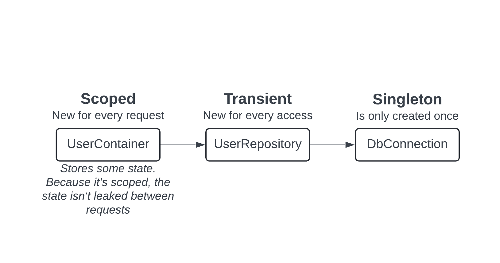

This is a quick example that uses `@Scoped`, `@Singleton` and `@Transient` decorators on different classes. It also uses `@Inject` to inject the dependencies and creates a new scope with a Scope Manager on each 'request'.

For more information about the usage of this Dependency Injection library and how this implementation works, please refer to the [documentation](../README.md).

## Dependency tree
